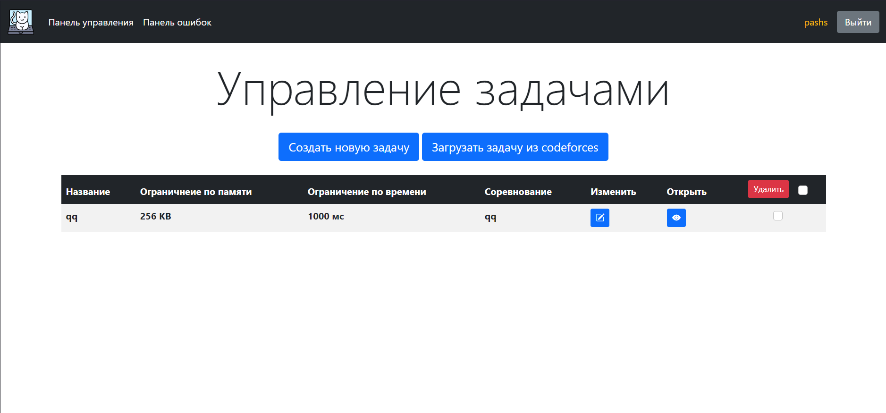

# Test System


Автоматическая тестирующая система для олимпиад и уроков информатики
 - [Установка](#установка)
    - [Локальная установка](#локальная-установка)
    - [Установка на сервере](#установка-на-сервер)
 - [Документация](#документация)
    - [Администраторам и учетелям](#администраторам-и-учетелям)
        - [Панель управления](#панель-управления)
            - [Управление юзерами](#управление-юзерами)
            - [Управление группами](#управление-группами)
            - [Управление вопросами](#управление-вопросами)
            - [Управление задачами](#управление-задачами)
            - [Управление соревнованиями](#управление-соревнованиями)
            - [Управление учителями](#управление-учителями)
        - [Панель ошибок](#панель-ошибок)
        - [Главная страница](#главная-страница)
        - [Внутренняя админ-панель](#внутренняя-админ-панель)
    - [Ученикам](#ученикам)
 - [Скриншоты](#скриншоты)

## Установка
### Локальная установка
*Я устанавливаю проект используя постгресс, если вы хотите любую другую бд, как ее настроить можно почитать в [Документации Django](https://docs.djangoproject.com/en/4.0/ref/databases/)*
1. Скачайте репозиторий
2. Установите библиотеки:
    ```bash
    sudo apt update
    sudo apt install python3-pip python3-dev libpq-dev postgresql postgresql-contrib
    ```
3. Создайте виртульное окружение:
    ```bash
    python3 -m venv venv
    source venv/bin/activate
    ```
4. Установите зависимости:
    ```bash
    pip install -r requirements.txt
    ```
5. Зайдите в консоль базы данных:
    ```bash
    sudo -u postgres psql 
    ```
6. Создайте базу данных:
    ```sql
    CREATE DATABASE olympiad;
    ```
7. Создайте пользователя:
    ```sql
    CREATE USER olympiad_user WITH PASSWORD 'olympiad';
    ```
8. Настройте права юзера:
   ```sql
   ALTER ROLE olimpiad_user SET client_encoding TO 'utf8';
   ALTER ROLE olimpiad_user SET default_transaction_isolation TO 'read committed';
   ALTER ROLE olimpiad_user SET timezone TO 'UTC';
   ```
9. Предоставьте юзеру доступ в базу данных:
    ```sql
    GRANT ALL PRIVILEGES ON DATABASE olympiad TO olympiad_user;
    ```
10. Выйдите из консоли базы данных:
    ```sql
    \q
    ```
11. Создайте файл конфигурации с названием `config.toml` и запишите в него следующие данные:
    ```toml
    [common]
    secret_key = "secret"
    debug = true
    [database]
    bd_name = "olimpiad"
    user = "olimpiad_user"
    password = "olimpiad"
    ```
12. Установите миграции;
    ```
    python manage.py makemigrations
    python manage.py migrate
    ```
13. Создайте суперпользователя:
    ```
    python manage.py createsuperuser
    ```
14. Запустите проект:
    ```
    python manage.py runserver
    ```
**После этих инструкций у вас запустится минимально рабочий проект. ЧАСТЬ ФИЧЕЙ НЕ БУДЕТ РАБОТАТЬ пока вы не установите Сelery и Redis инструкция по установке находится [вот здесь](https://hashsum.ru/celery-django-redis/)**

### Установка на сервер
Я использовал инструкцию по установке от [DigitalOcean](https://www.digitalocean.com/community/tutorials/how-to-install-and-configure-django-on-ubuntu-16-04), там все очень подробно описанно, кроме того что нужно обязательно создавать еще одного юзера, кроме рута.

## Документация
## Администраторам и учетелям
## Панель управления
### Управление юзерами

**Система не позовляет самотсояетльно создавать юзеров ученикам, вместо этого она сама может генерировать готовых юзеров и пароли**

Для того что бы создать юзеров нажмите на соответствующую кнопку в панели управления и выберите желаемое количество. Что бы увидеть новых юзеров надо перезагрузить страницу.

Система создаст таблицу в которой будут хранится все юзеры, их пароли групппы и учетеля.

У каждого юзера можно менять имя.

Кнопка "Создать таблицу юзеров" создает выгрузку всех юзеров в .csv файл.

### Управление группами

Группы позволяют соеденять учеников и соревнования.

### Управление вопросами

Вопросы это задания которые не требуют сложной проверки при ответе.

Страница впросов содержит список всез существующих вопросов и позволяет менять и смтореть их.

Существует 3 вида вопросов:
- Вопрос с одним вариантом ответа
- Вопрос с несколькими вариантами ответа
- Вопрос со свободным ответом


При создании вопроса необходимо обязательно указать название, текст, и тип вопроса. Кроме этого можно загрузить картинку и файл и указать теги.
С помощью тегов вопросы можно искатьв панели создания соревнований (что бы поиск по тегам заработал нужно написать #тег)

### Управление задачами

**Кнопка Загрузить с Codeforces находится в разработке**

Страница задач содержит список всез существующих задач и позволяет менять и смтореть их.


При создании задачи в полях описания, примера входа и выхода можно использовать Latex. Весь ввод удет сражу же рендериться внизу.

Кроме этого для каждой задачи нужно загрузить идеальное решение(на Python или C++), чекер и набор тестов в .zip. [Пример набора этих файлов](https://drive.google.com/drive/folders/1aZ9a05B2iTO3sDAPxirYfF5DPlr7O5Gq?usp=sharing)

После создания задачи создается страница управления задачей. Она аналогична странице создания за исключением блока тестов.

В этом блоке указаны тесты и ответы на них (ответы генерируются идеальным решением и при проблеме с ним вместо ответов будет ошибка)

Тесты можно сделать примерами, и тогда они будут показаны на странце задач.

### Управление соревнованиями
